# 📌 Mini Drive - 요구사항 분석서

> 조직 내 파일 관리 및 협업을 위한 웹 기반 클라우드 시스템

---

## 제/개정 이력

| 버전 | 날짜 | 작성자 | 제/개정사항 | 비고 |
|------|------|--------|-------------|------|
| 1.0 | 2025-05-14 | 김지현 | 최초 작성 | 요구사항 분석서 |

---

## 목 차

1. 서론
   - 1.1 목적 및 범위
   - 1.2 용어 정의
   - 1.3 참조 문서
2. 시스템 개요
   - 2.1 소프트웨어 컨텍스트(Context)
   - 2.2 기능 분류 및 설명
3. 요구사항 명세
   - 3.1 정적 분석 (클래스 다이어그램)
   - 3.2 CRC 카드
   - 3.3 동적 분석 (순차 다이어그램)
   - 3.4 상태기계 다이어그램
4. 인터페이스 분석
5. 제약사항
6. 요구사항 추적표
7. 참고문헌 및 부록

---

## 1. 서론

### 1.1 목적 및 범위

이 문서는 **Mini Drive** 시스템에 대한 요구사항 분석을 수행하기 위한 문서이다.  
Mini Drive는 조직 내 파일을 중앙에서 관리하고 사용자 간 공유를 지원하는 웹 기반 클라우드 파일 관리 시스템으로,  
기능 관점(유스케이스 다이어그램 및 설명서), 구조 관점(클래스 다이어그램), 행위 관점(순차 다이어그램)에서 요구사항을 정의한다.

이 문서는 시스템의 기능적 요구사항, 비기능적 요구사항, 인터페이스 요구사항을 포함하며,  
개발자, 설계자, 이해관계자가 시스템의 요구사항을 이해하고 검증하는 데 활용된다.

### 1.2 용어 정의

| 용어 | 설명 |
|------|------|
| 클라우드 스토리지 | 인터넷 기반 파일 저장 시스템 |
| 버전 관리 | 파일 변경 이력을 저장하고 이전 상태로 복원하는 기능 |
| 권한 관리 | 사용자별 파일 접근 권한(읽기/수정/댓글)을 설정하는 기능 |
| 외부 공유 링크 | 시스템 계정 없이도 파일에 접근할 수 있도록 생성하는 URL |
| API | 시스템 간 기능을 연결하는 인터페이스 |
| 액터(Actor) | 시스템과 상호작용하는 외부 개체 (사람 또는 외부 시스템) |

### 1.3 참조 문서

- `project1_definition.md` - Mini Drive 시스템 정의서
- `project2_quality_attributes.md` - Mini Drive 품질 요소 정의서
- `project4_requirements.md` - Mini Drive 요구사항 정의서

---

## 2. 시스템 개요

### 2.1 소프트웨어 컨텍스트(Context)

#### 2.1.1 액터 테이블

| 액터 | 역할 |
|------|------|
| 일반 사용자 | 시스템에 로그인하여 파일 업로드, 다운로드, 검색, 공유 등을 수행하는 조직 내 구성원 |
| 관리자 | 사용자 계정 및 권한을 관리하고 시스템 로그를 조회하는 권한을 가진 사용자 |
| 외부 사용자 | 외부 공유 링크를 통해 특정 파일에만 접근 가능한 비인증 사용자 |
| 시스템 | 파일 버전 저장, 삭제 파일 임시 보관, 로그 기록 등 자동으로 동작하는 내부 주체 |

#### 2.1.2 유스케이스 다이어그램

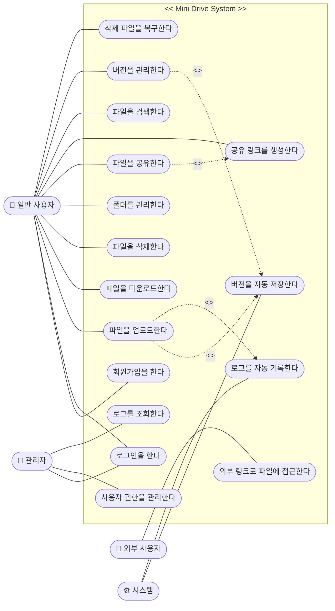

---

### 2.2 기능 분류 및 설명

#### 2.2.1 유스케이스 설명서

---

**유스케이스 이름:** 회원가입을 한다  
**ID:** U_01 | **중요도:** 상  
**주요 액터:** 일반 사용자  
**유스케이스 유형:** 상세, 필수

**간략 설명:**  
이 유스케이스는 사용자가 Mini Drive 시스템에 계정을 생성하는 과정을 표현한다.

**이해관계자 및 관심사**
- 일반 사용자: 시스템을 이용하기 위해 회원가입을 원한다.

**트리거:** 사용자가 회원가입 버튼을 클릭한다.

**관계**
- 연관: 일반 사용자
- 포함: 없음
- 확장: 없음

**정상 흐름:**
1. 사용자는 이름, 이메일, 비밀번호를 입력한다.
2. 사용자는 회원가입 버튼을 클릭한다.
3. 시스템은 입력값을 검증한다.
4. 시스템은 회원가입을 완료하고 로그인 화면으로 이동한다.

**대안 / 예외 흐름:**
- 2.a1: 공란이 있을 경우 시스템은 필수 입력 항목 안내 메시지를 출력한다.
- 2.a2: 이미 등록된 이메일인 경우 시스템은 중복 이메일 안내 메시지를 출력한다.

---

**유스케이스 이름:** 로그인을 한다  
**ID:** U_02 | **중요도:** 상  
**주요 액터:** 일반 사용자  
**유스케이스 유형:** 상세, 필수

**간략 설명:**  
이 유스케이스는 사용자가 이메일과 비밀번호로 시스템에 인증하는 과정을 표현한다.

**이해관계자 및 관심사**
- 일반 사용자: 시스템 기능을 이용하기 위해 로그인을 원한다.

**트리거:** 사용자가 로그인 버튼을 클릭한다.

**관계**
- 연관: 일반 사용자
- 포함: 없음

**정상 흐름:**
1. 사용자는 이메일, 비밀번호를 입력한다.
2. 사용자는 로그인 버튼을 클릭한다.
3. 시스템은 자격증명을 검증한다.
4. 로그인이 성공하면 메인 화면으로 이동한다.

**대안 / 예외 흐름:**
- 3.a1: 이메일 또는 비밀번호가 틀릴 경우 시스템은 로그인 실패 메시지를 출력한다.

---

**유스케이스 이름:** 파일을 업로드한다  
**ID:** U_03 | **중요도:** 상  
**주요 액터:** 일반 사용자  
**유스케이스 유형:** 상세, 필수

**간략 설명:**  
이 유스케이스는 사용자가 로컬 파일을 시스템에 업로드하는 과정을 표현한다.

**이해관계자 및 관심사**
- 일반 사용자: 관리할 파일을 시스템에 저장하길 원한다.

**트리거:** 사용자가 파일 업로드 버튼을 클릭한다.

**관계**
- 연관: 일반 사용자
- 포함: 버전을 자동 저장한다 (U_10)

**정상 흐름:**
1. 사용자는 업로드할 파일을 선택한다.
2. 사용자는 업로드 버튼을 클릭한다.
3. 시스템은 파일을 저장하고, 버전 이력을 자동 생성한다.
4. 시스템은 업로드 완료 메시지를 출력한다.

**대안 / 예외 흐름:**
- 2.a1: 지원하지 않는 파일 형식이거나 용량 초과인 경우 시스템은 실패 메시지를 출력한다.

---

**유스케이스 이름:** 파일을 다운로드한다  
**ID:** U_04 | **중요도:** 상  
**주요 액터:** 일반 사용자  
**유스케이스 유형:** 상세, 필수

**간략 설명:**  
이 유스케이스는 사용자가 시스템에 저장된 파일을 로컬로 내려받는 과정을 표현한다.

**이해관계자 및 관심사**
- 일반 사용자: 필요한 파일을 로컬 환경에서 사용하길 원한다.

**트리거:** 사용자가 파일 다운로드 버튼을 클릭한다.

**관계**
- 연관: 일반 사용자

**정상 흐름:**
1. 사용자는 다운로드할 파일을 선택한다.
2. 사용자는 다운로드 버튼을 클릭한다.
3. 시스템은 해당 파일을 사용자 로컬로 전송한다.

**대안 / 예외 흐름:**
- 2.a1: 접근 권한이 없는 파일인 경우 시스템은 접근 거부 메시지를 출력한다.

---

**유스케이스 이름:** 파일을 삭제한다  
**ID:** U_05 | **중요도:** 중  
**주요 액터:** 일반 사용자  
**유스케이스 유형:** 상세, 필수

**간략 설명:**  
이 유스케이스는 사용자가 자신의 파일을 시스템에서 삭제하는 과정을 표현한다.

**이해관계자 및 관심사**
- 일반 사용자: 불필요한 파일을 정리하길 원한다.

**트리거:** 사용자가 파일 삭제 버튼을 클릭한다.

**관계**
- 연관: 일반 사용자

**정상 흐름:**
1. 사용자는 삭제할 파일을 선택한다.
2. 사용자는 삭제 버튼을 클릭한다.
3. 시스템은 파일을 휴지통으로 이동하고 일정 기간 보관한다.

**대안 / 예외 흐름:**
- 없음

---

**유스케이스 이름:** 폴더를 관리한다  
**ID:** U_06 | **중요도:** 상  
**주요 액터:** 일반 사용자  
**유스케이스 유형:** 상세, 필수

**간략 설명:**  
이 유스케이스는 사용자가 폴더를 생성, 삭제, 이름 변경하는 과정을 표현한다.

**이해관계자 및 관심사**
- 일반 사용자: 파일을 체계적으로 분류하기 위해 폴더를 관리하길 원한다.

**트리거:** 사용자가 폴더 관리 버튼을 클릭한다.

**관계**
- 연관: 일반 사용자

**정상 흐름:**
1. S-1: 폴더 생성 - 사용자는 폴더 이름을 입력하고 생성 버튼을 클릭한다.
2. S-2: 폴더 삭제 - 사용자는 삭제할 폴더를 선택하고 삭제 버튼을 클릭한다.
3. S-3: 이름 변경 - 사용자는 폴더를 선택하고 새 이름을 입력한다.

**대안 / 예외 흐름:**
- 1.a1: 이미 존재하는 폴더 이름인 경우 시스템은 중복 이름 안내 메시지를 출력한다.

---

**유스케이스 이름:** 파일을 공유한다  
**ID:** U_07 | **중요도:** 상  
**주요 액터:** 일반 사용자  
**유스케이스 유형:** 상세, 필수

**간략 설명:**  
이 유스케이스는 사용자가 다른 사용자와 파일을 공유하고 접근 권한을 설정하는 과정을 표현한다.

**이해관계자 및 관심사**
- 일반 사용자: 동료와 파일을 협업 목적으로 공유하길 원한다.

**트리거:** 사용자가 파일 공유 버튼을 클릭한다.

**관계**
- 연관: 일반 사용자

**정상 흐름:**
1. 사용자는 공유할 파일을 선택한다.
2. 사용자는 공유할 대상의 이메일을 입력한다.
3. 사용자는 권한(읽기 / 수정 / 댓글)을 설정한다.
4. 시스템은 공유 설정을 저장하고 대상 사용자에게 알림을 보낸다.

**대안 / 예외 흐름:**
- 2.a1: 존재하지 않는 사용자 이메일인 경우 시스템은 오류 메시지를 출력한다.

---

**유스케이스 이름:** 공유 링크를 생성한다  
**ID:** U_08 | **중요도:** 상  
**주요 액터:** 일반 사용자  
**유스케이스 유형:** 상세, 필수

**간략 설명:**  
이 유스케이스는 사용자가 외부 공유용 링크를 생성하고 만료 시간을 설정하는 과정을 표현한다.

**이해관계자 및 관심사**
- 일반 사용자: 계정이 없는 외부인에게도 파일을 전달하길 원한다.

**트리거:** 사용자가 링크 생성 버튼을 클릭한다.

**관계**
- 연관: 일반 사용자

**정상 흐름:**
1. 사용자는 공유할 파일을 선택한다.
2. 사용자는 링크 생성 버튼을 클릭한다.
3. 사용자는 만료 시간을 설정한다.
4. 시스템은 공유 링크를 생성하여 사용자에게 제공한다.

**대안 / 예외 흐름:**
- 없음

---

**유스케이스 이름:** 파일을 검색한다  
**ID:** U_09 | **중요도:** 상  
**주요 액터:** 일반 사용자  
**유스케이스 유형:** 상세, 필수

**간략 설명:**  
이 유스케이스는 사용자가 파일 이름 또는 필터 조건으로 파일을 검색하는 과정을 표현한다.

**이해관계자 및 관심사**
- 일반 사용자: 많은 파일 중에서 원하는 파일을 빠르게 찾길 원한다.

**트리거:** 사용자가 검색창에 키워드를 입력한다.

**관계**
- 연관: 일반 사용자

**정상 흐름:**
1. 사용자는 검색창에 파일 이름 또는 키워드를 입력한다.
2. 사용자는 날짜, 파일 유형 등 필터 조건을 선택한다.
3. 시스템은 조건에 맞는 파일 목록을 3초 이내에 반환한다.

**대안 / 예외 흐름:**
- 3.a1: 검색 결과가 없는 경우 시스템은 결과 없음 메시지를 출력한다.

---

**유스케이스 이름:** 버전을 관리한다  
**ID:** U_10 | **중요도:** 상  
**주요 액터:** 일반 사용자  
**유스케이스 유형:** 상세, 필수

**간략 설명:**  
이 유스케이스는 사용자가 파일의 변경 이력을 조회하고 이전 버전으로 복원하는 과정을 표현한다.

**이해관계자 및 관심사**
- 일반 사용자: 실수로 수정된 파일을 이전 상태로 되돌리길 원한다.

**트리거:** 사용자가 버전 관리 버튼을 클릭한다.

**관계**
- 연관: 일반 사용자
- 포함: 버전을 자동 저장한다

**정상 흐름:**
1. 사용자는 버전 이력을 조회할 파일을 선택한다.
2. 시스템은 해당 파일의 버전 목록을 출력한다.
3. 사용자는 복원할 버전을 선택한다.
4. 시스템은 선택한 버전으로 파일을 복원한다.

**대안 / 예외 흐름:**
- 없음

---

**유스케이스 이름:** 삭제 파일을 복구한다  
**ID:** U_11 | **중요도:** 상  
**주요 액터:** 일반 사용자  
**유스케이스 유형:** 상세, 필수

**간략 설명:**  
이 유스케이스는 사용자가 삭제된 파일을 휴지통에서 복구하는 과정을 표현한다.

**이해관계자 및 관심사**
- 일반 사용자: 실수로 삭제한 파일을 되찾길 원한다.

**트리거:** 사용자가 휴지통에서 복구 버튼을 클릭한다.

**관계**
- 연관: 일반 사용자

**정상 흐름:**
1. 사용자는 휴지통 화면으로 이동한다.
2. 사용자는 복구할 파일을 선택하고 복구 버튼을 클릭한다.
3. 시스템은 해당 파일을 원래 위치로 복원한다.

**대안 / 예외 흐름:**
- 2.a1: 보관 기간이 만료된 파일은 복구할 수 없으며 시스템은 만료 안내 메시지를 출력한다.

---

**유스케이스 이름:** 사용자 권한을 관리한다  
**ID:** U_12 | **중요도:** 상  
**주요 액터:** 관리자  
**유스케이스 유형:** 상세, 필수

**간략 설명:**  
이 유스케이스는 관리자가 사용자 계정의 권한을 설정하는 과정을 표현한다.

**이해관계자 및 관심사**
- 관리자: 조직 내 사용자의 접근 권한을 통제하길 원한다.

**트리거:** 관리자가 사용자 관리 메뉴를 클릭한다.

**관계**
- 연관: 관리자

**정상 흐름:**
1. 관리자는 사용자 목록을 조회한다.
2. 관리자는 대상 사용자를 선택한다.
3. 관리자는 해당 사용자의 권한(일반/관리자)을 설정한다.
4. 시스템은 권한 변경 사항을 저장한다.

**대안 / 예외 흐름:**
- 없음

---

**유스케이스 이름:** 로그를 조회한다  
**ID:** U_13 | **중요도:** 중  
**주요 액터:** 관리자  
**유스케이스 유형:** 상세, 필수

**간략 설명:**  
이 유스케이스는 관리자가 사용자 활동 이력 및 시스템 로그를 조회하는 과정을 표현한다.

**이해관계자 및 관심사**
- 관리자: 시스템의 이상 여부와 사용자 활동을 모니터링하길 원한다.

**트리거:** 관리자가 로그 조회 메뉴를 클릭한다.

**관계**
- 연관: 관리자

**정상 흐름:**
1. 관리자는 로그 조회 화면으로 이동한다.
2. 관리자는 조회 기간, 사용자, 이벤트 유형 등 필터를 설정한다.
3. 시스템은 조건에 맞는 로그 목록을 출력한다.

**대안 / 예외 흐름:**
- 3.a1: 조회 결과가 없는 경우 시스템은 결과 없음 메시지를 출력한다.

---

## 3. 요구사항 명세

### 3.1 정적 분석 (클래스 다이어그램)

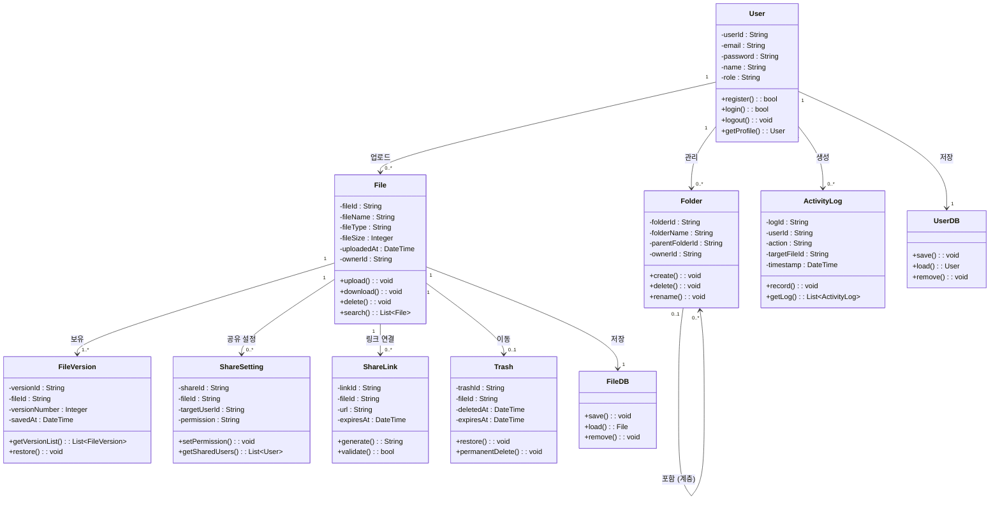

---

### 3.2 CRC 카드

---

**클래스 이름:** User | **ID:** 01 | **유형:** 구체, 도메인

**설명:**  
Mini Drive 시스템을 사용하는 조직 내 구성원 또는 관리자를 나타낸다.

**연관 유스케이스:** U_01, U_02, U_03, U_04, U_05, U_06, U_07, U_08, U_09, U_10, U_11, U_12

| 책임 | 협력자 |
|------|------|
| register() : bool | UserDB |
| login() : bool | UserDB |
| logout() : void | - |
| getProfile() : User | UserDB |

**속성**
- userId : String
- email : String
- password : String
- name : String
- role : String (일반 / 관리자)

**관계**
- 일반화 (a-kind-of): -
- 집합 (has-parts): -
- 기타 연관: File, Folder, ActivityLog

---

**클래스 이름:** File | **ID:** 02 | **유형:** 구체, 도메인

**설명:**  
사용자가 업로드한 파일을 나타낸다.

**연관 유스케이스:** U_03, U_04, U_05, U_07, U_08, U_09, U_10, U_11

| 책임 | 협력자 |
|------|------|
| upload() : void | FileDB, FileVersion |
| download() : void | User |
| delete() : void | Trash |
| search() : List~File~ | User |

**속성**
- fileId : String
- fileName : String
- fileType : String
- fileSize : Integer
- uploadedAt : DateTime
- ownerId : String

**관계**
- 일반화 (a-kind-of): -
- 집합 (has-parts): FileVersion, ShareSetting, ShareLink
- 기타 연관: Folder, Trash, FileDB

---

**클래스 이름:** Folder | **ID:** 03 | **유형:** 구체, 도메인

**설명:**  
파일을 계층적으로 분류하기 위한 폴더를 나타낸다.

**연관 유스케이스:** U_06

| 책임 | 협력자 |
|------|------|
| create() : void | User |
| delete() : void | User |
| rename() : void | User |

**속성**
- folderId : String
- folderName : String
- parentFolderId : String
- ownerId : String

**관계**
- 일반화 (a-kind-of): -
- 집합 (has-parts): File, Folder (자식 폴더)
- 기타 연관: User

---

**클래스 이름:** FileVersion | **ID:** 04 | **유형:** 구체, 도메인

**설명:**  
파일의 변경 이력(버전)을 나타낸다.

**연관 유스케이스:** U_03, U_10

| 책임 | 협력자 |
|------|------|
| getVersionList() : List~FileVersion~ | User, File |
| restore() : void | File |

**속성**
- versionId : String
- fileId : String
- versionNumber : Integer
- savedAt : DateTime

**관계**
- 일반화 (a-kind-of): -
- 집합 (has-parts): -
- 기타 연관: File

---

**클래스 이름:** ShareSetting | **ID:** 05 | **유형:** 구체, 도메인

**설명:**  
사용자 간 파일 공유 권한 설정을 나타낸다.

**연관 유스케이스:** U_07

| 책임 | 협력자 |
|------|------|
| setPermission() : void | User, File |
| getSharedUsers() : List~User~ | File |

**속성**
- shareId : String
- fileId : String
- targetUserId : String
- permission : String (읽기 / 수정 / 댓글)

**관계**
- 일반화 (a-kind-of): -
- 집합 (has-parts): -
- 기타 연관: File, User

---

**클래스 이름:** ShareLink | **ID:** 06 | **유형:** 구체, 도메인

**설명:**  
외부 공유용 링크를 나타낸다.

**연관 유스케이스:** U_08

| 책임 | 협력자 |
|------|------|
| generate() : String | User, File |
| validate() : bool | 외부 사용자 |

**속성**
- linkId : String
- fileId : String
- url : String
- expiresAt : DateTime

**관계**
- 일반화 (a-kind-of): -
- 집합 (has-parts): -
- 기타 연관: File

---

**클래스 이름:** Trash | **ID:** 07 | **유형:** 구체, 도메인

**설명:**  
삭제된 파일을 일정 기간 보관하는 휴지통을 나타낸다.

**연관 유스케이스:** U_05, U_11

| 책임 | 협력자 |
|------|------|
| restore() : void | User, File |
| permanentDelete() : void | 시스템 |

**속성**
- trashId : String
- fileId : String
- deletedAt : DateTime
- expiresAt : DateTime

**관계**
- 일반화 (a-kind-of): -
- 집합 (has-parts): -
- 기타 연관: File

---

**클래스 이름:** ActivityLog | **ID:** 08 | **유형:** 구체, 도메인

**설명:**  
사용자의 주요 활동 이력 및 시스템 오류 로그를 기록하는 클래스이다.

**연관 유스케이스:** U_13

| 책임 | 협력자 |
|------|------|
| record() : void | 시스템 |
| getLog() : List~ActivityLog~ | 관리자(User) |

**속성**
- logId : String
- userId : String
- action : String
- targetFileId : String
- timestamp : DateTime

**관계**
- 일반화 (a-kind-of): -
- 집합 (has-parts): -
- 기타 연관: User

---

**클래스 이름:** FileDB | **ID:** 09 | **유형:** 구체, 도메인

**설명:**  
파일 데이터를 저장하고 불러오는 데이터베이스 객체를 나타낸다.

**연관 유스케이스:** U_03, U_04, U_05

| 책임 | 협력자 |
|------|------|
| save() : void | File |
| load() : File | File |
| remove() : void | File |

**속성**
- (없음, DB 추상화 레이어)

**관계**
- 일반화 (a-kind-of): -
- 집합 (has-parts): File
- 기타 연관: -

---

**클래스 이름:** UserDB | **ID:** 10 | **유형:** 구체, 도메인

**설명:**  
사용자 계정 정보를 저장하고 불러오는 데이터베이스 객체를 나타낸다.

**연관 유스케이스:** U_01, U_02, U_12

| 책임 | 협력자 |
|------|------|
| save() : void | User |
| load() : User | User |
| remove() : void | 관리자(User) |

**속성**
- (없음, DB 추상화 레이어)

**관계**
- 일반화 (a-kind-of): -
- 집합 (has-parts): User
- 기타 연관: -

---

### 3.3 동적 분석 (순차 다이어그램)

#### 3.3.1 회원가입을 한다

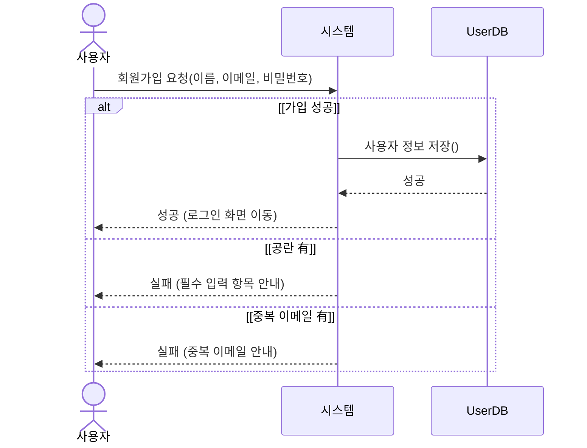

#### 3.3.2 로그인을 한다

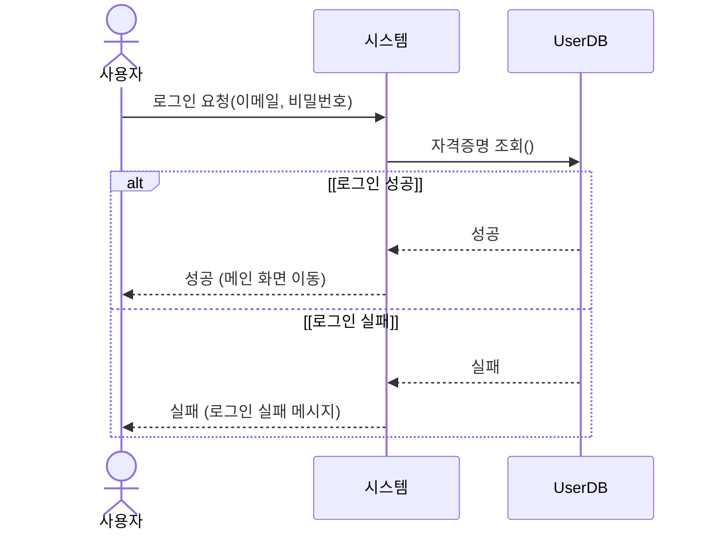

#### 3.3.3 파일을 업로드한다

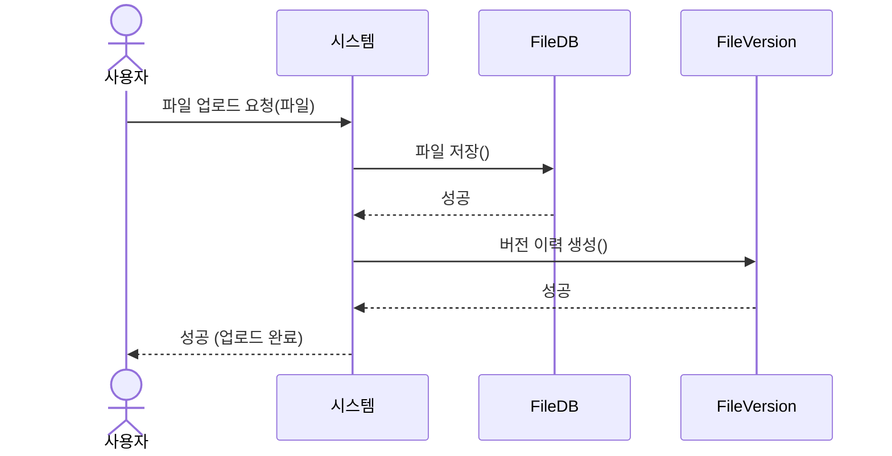

#### 3.3.4 파일을 다운로드한다

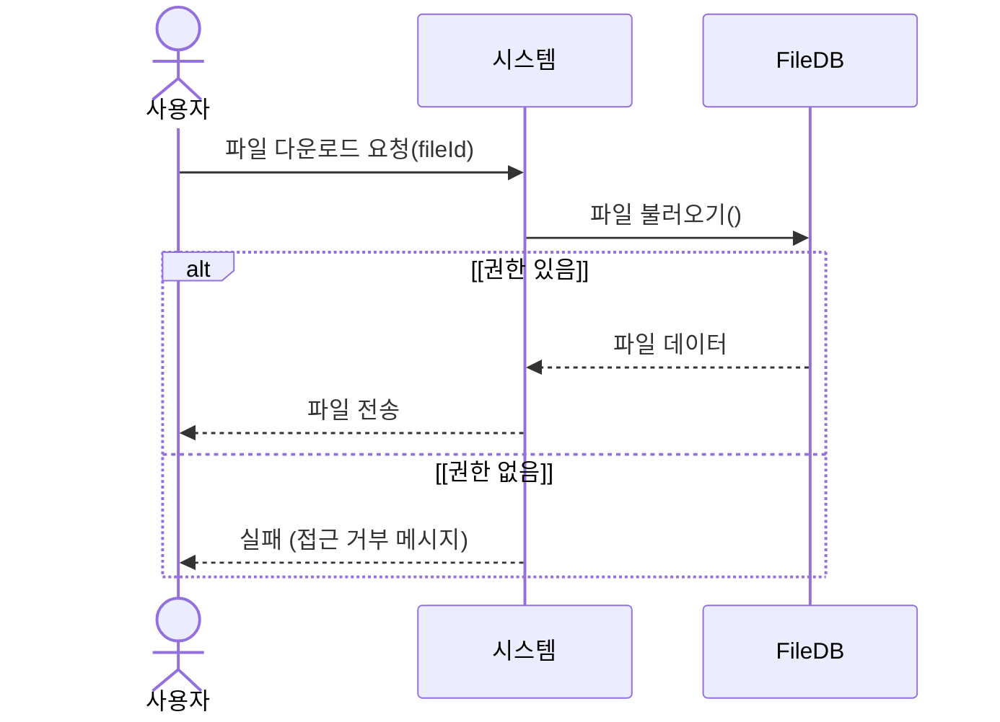

#### 3.3.5 파일을 삭제한다

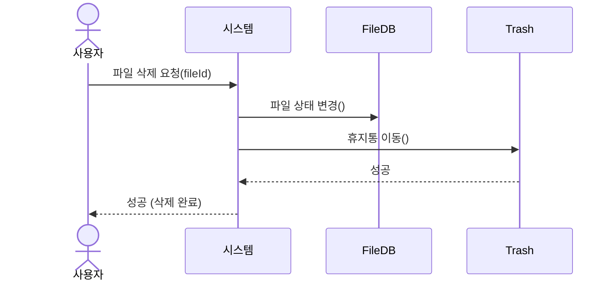

#### 3.3.6 파일을 공유한다

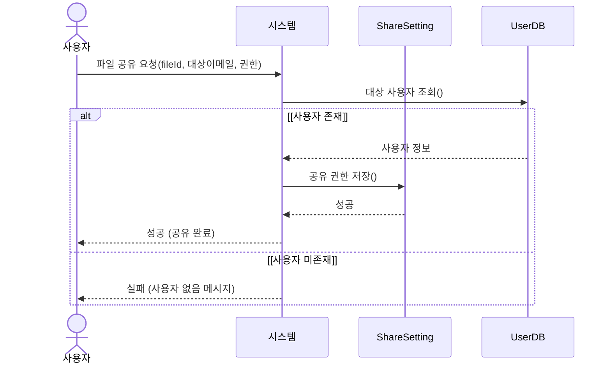

#### 3.3.7 공유 링크를 생성한다

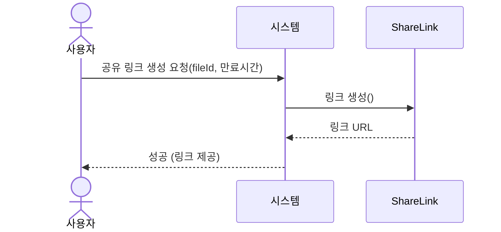

#### 3.3.8 파일을 검색한다

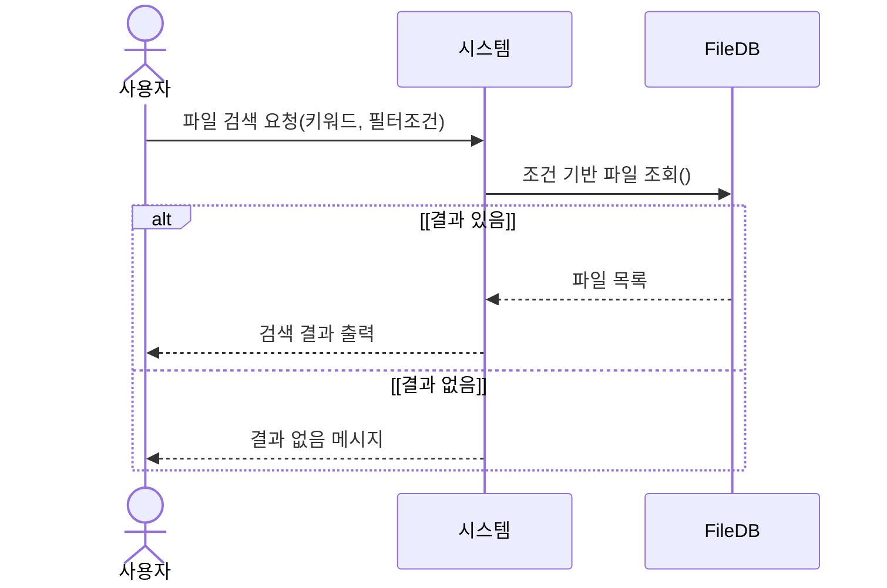

#### 3.3.9 버전을 관리한다 (조회 및 복원)

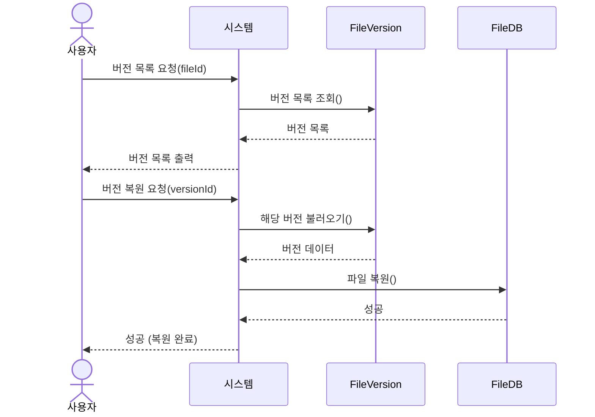

#### 3.3.10 삭제 파일을 복구한다

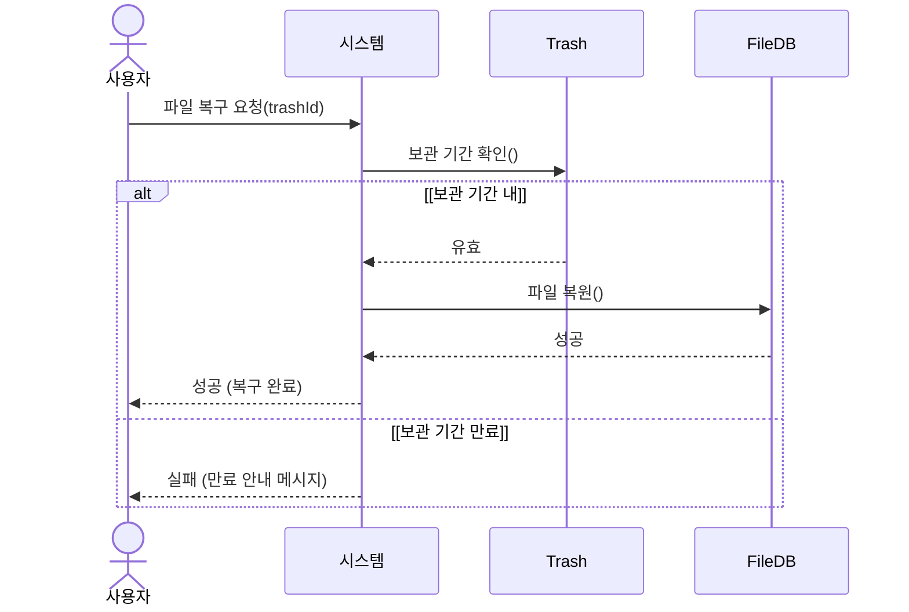

### 3.4 상태기계 다이어그램

#### 3.4.1 File (파일) 상태기계 다이어그램

파일 객체는 업로드 시점부터 영구 삭제까지 다음과 같은 상태 전이를 가진다.

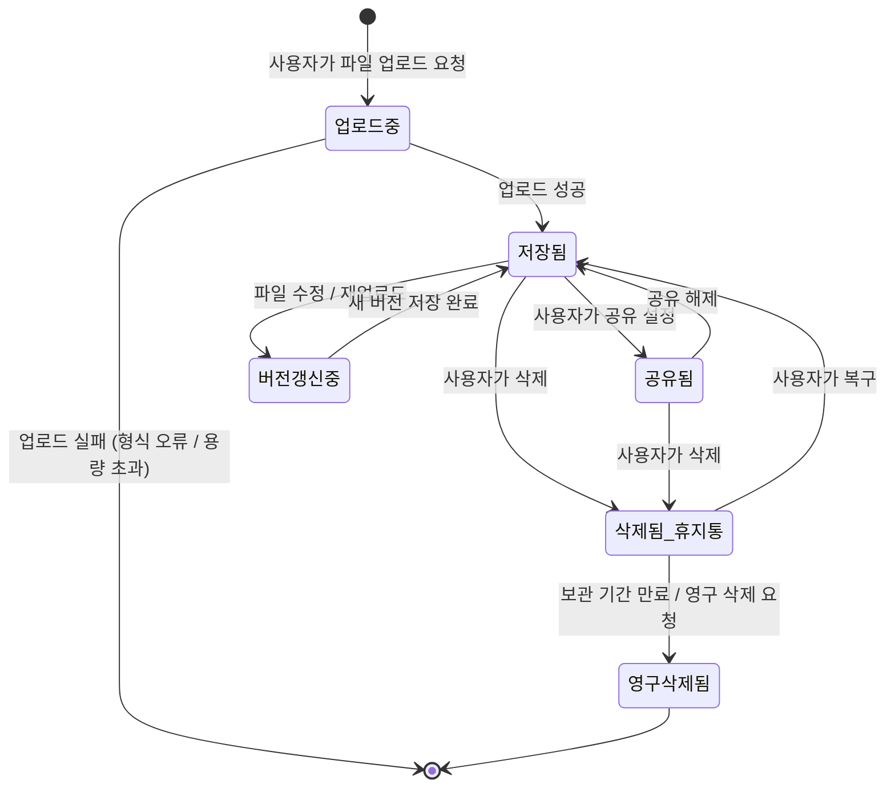

#### 3.4.2 ShareLink (공유 링크) 상태기계 다이어그램

공유 링크 객체는 생성 이후 유효 기간 및 접근 여부에 따라 다음과 같은 상태 전이를 가진다.

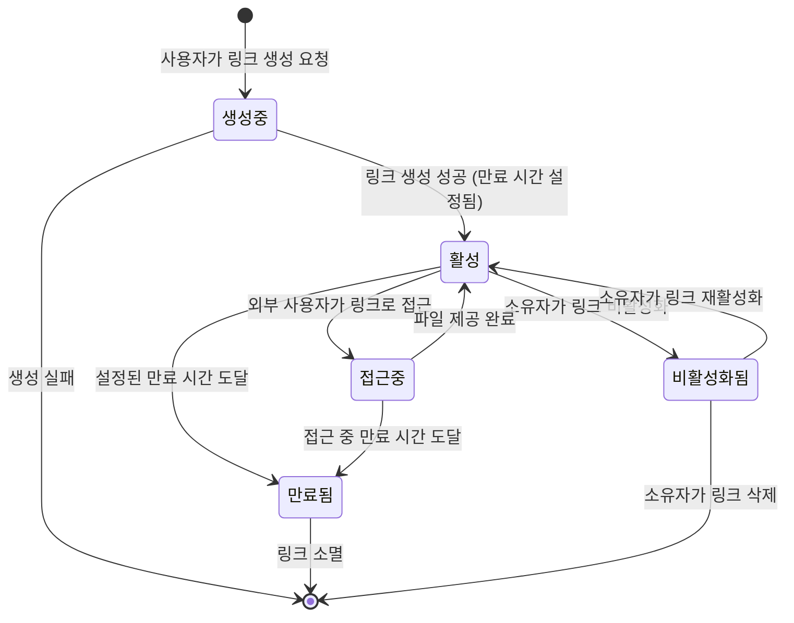

---

## 4. 인터페이스 분석

| ID | 인터페이스 | 설명 |
|----|-----------|------|
| IR-001 | 로그인 화면 | 이메일과 비밀번호를 입력하여 로그인할 수 있는 화면 |
| IR-002 | 메인(파일 목록) 화면 | 파일 및 폴더 목록을 계층 구조로 확인하고 관리할 수 있는 화면 |
| IR-003 | 파일 업로드/다운로드 화면 | 파일을 업로드하거나 다운로드할 수 있는 화면 |
| IR-004 | 폴더 관리 화면 | 폴더를 생성, 삭제, 이름 변경할 수 있는 화면 |
| IR-005 | 공유 설정 화면 | 파일 공유 권한 및 외부 공유 링크를 설정할 수 있는 화면 |
| IR-006 | 검색 화면 | 파일 이름 및 필터 조건으로 파일을 검색할 수 있는 화면 |
| IR-007 | 버전 관리 화면 | 파일의 이전 버전을 조회하고 복원할 수 있는 화면 |
| IR-008 | 휴지통 화면 | 삭제된 파일을 복구하거나 영구 삭제할 수 있는 화면 |
| IR-009 | 관리자 화면 | 사용자 권한 관리 및 시스템 로그를 조회할 수 있는 화면 |

---

## 5. 제약사항

| 구분 | 내용 |
|------|------|
| 운영 환경 | 웹 브라우저 기반으로 동작하며 별도의 설치가 필요하지 않아야 한다. |
| 성능 | 100MB 이하 파일 업로드/다운로드는 10초 이내에 처리되어야 한다. |
| 성능 | 검색 기능은 3초 이내에 응답하여야 한다. |
| 동시 접속 | 약 200명의 사용자가 동시 접속해도 주요 기능이 정상 동작하여야 한다. |
| 보안 | 사용자 비밀번호는 암호화하여 저장하여야 한다. |
| 보안 | 권한 없는 사용자는 파일에 접근할 수 없어야 한다. |
| 사용성 | 주요 기능은 3단계 이내의 화면 이동으로 수행 가능하여야 한다. |
| 유지보수성 | 기능별 모듈 구조로 설계되어 유지보수가 용이하여야 한다. |

---

## 6. 요구사항 추적표

| 요구사항 ID | U_01 | U_02 | U_03 | U_04 | U_05 | U_06 | U_07 | U_08 | U_09 | U_10 | U_11 | U_12 | U_13 |
|------------|------|------|------|------|------|------|------|------|------|------|------|------|------|
| FR-001 | O | | | | | | | | | | | | |
| FR-002 | | O | | | | | | | | | | | |
| FR-003 | | O | | | | | | | | | | | |
| FR-004 | | | | | | | | | | | | O | |
| FR-005 | | | O | | | | | | | | | | |
| FR-006 | | | | O | | | | | | | | | |
| FR-007 | | | O | O | | | | | | | | | |
| FR-008 | | | | | O | | | | | | | | |
| FR-009 | | | | | | O | | | | | | | |
| FR-010 | | | | | | O | | | | | | | |
| FR-011 | | | | | | O | | | | | | | |
| FR-012 | | | | | | O | | | | | | | |
| FR-013 | | | | | | | O | | | | | | |
| FR-014 | | | | | | | O | | | | | | |
| FR-015 | | | | | | | | O | | | | | |
| FR-016 | | | | | | | | O | | | | | |
| FR-017 | | | | | | | | | O | | | | |
| FR-018 | | | | | | | | | O | | | | |
| FR-019 | | | O | | | | | | | O | | | |
| FR-020 | | | | | | | | | | O | | | |
| FR-021 | | | | | | | | | | O | | | |
| FR-022 | | | | | O | | | | | | O | | |
| FR-023 | | | | | | | | | | | O | | |
| FR-024 | | | | | | | | | | | | | O |
| FR-025 | | | | | | | | | | | | | O |
| FR-026 | | | | | | | | | | | | | O |

---

## 7. 참고문헌 및 부록

- `project1_definition.md` - Mini Drive 시스템 정의서
- `project4_requirements.md` - Mini Drive 요구사항 정의서
